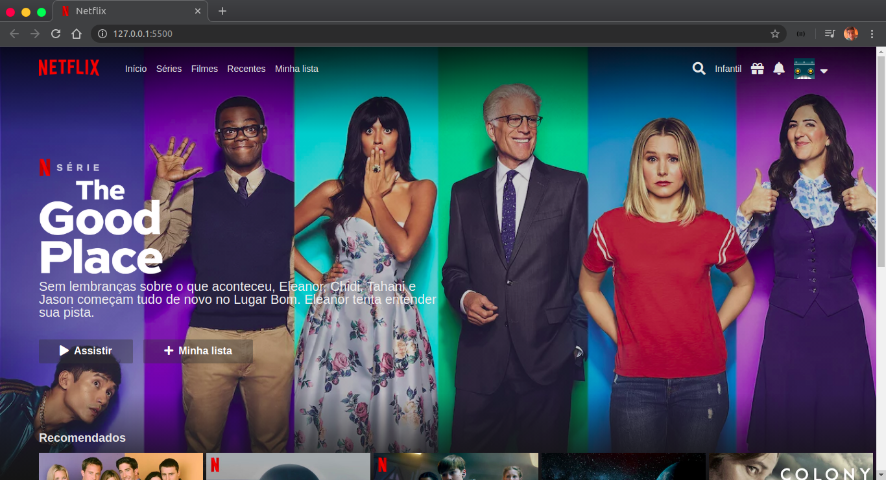

<h1 align="center">
    
</h1>

<h4 align="center">
   👀 netflix-clone
</h4>

## 💻 Projeto

Page desenvolvida para treinar as minhas habilidades com css, especialmente com o fantástico flexbox!

<h1 align="center">
  
</h1>

## 🎥 Pŕevia da Aplicação

<h1 align="center">
  
</h1>
